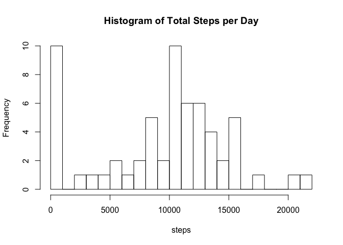
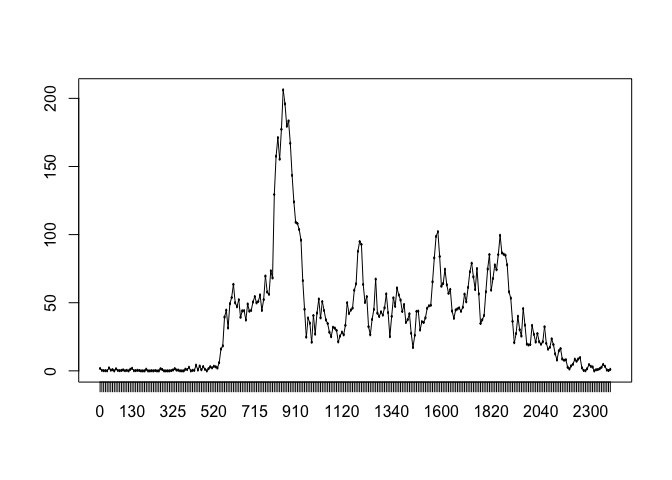
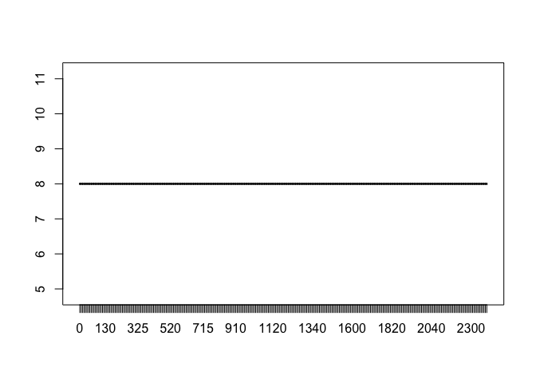
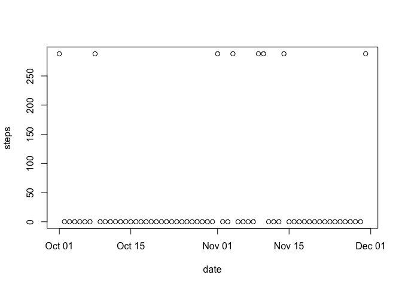
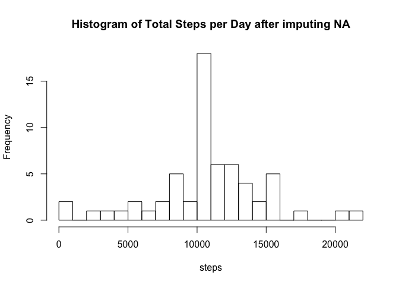
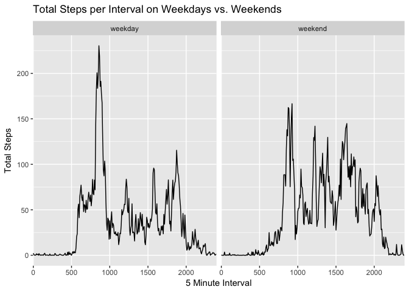
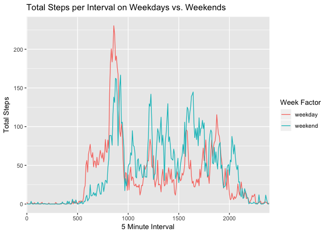

## Loading and preprocessing the data


```r
suppressMessages(suppressWarnings(library(dplyr)))
suppressMessages(suppressWarnings(library(magrittr)))
suppressMessages(suppressWarnings(library(ggplot2)))


if(!file.exists("./data")){dir.create("./data")}
fileUrl1 <- "https://d396qusza40orc.cloudfront.net/repdata%2Fdata%2Factivity.zip"
download.file(fileUrl1,destfile="./data/activity_rr.zip",method="curl")
unzip(zipfile="./data/activity_rr.zip",exdir="./data")

activity.rr1 <- read.csv("./data/activity.csv")

str(activity.rr1)
```

```
## 'data.frame':	17568 obs. of  3 variables:
##  $ steps   : int  NA NA NA NA NA NA NA NA NA NA ...
##  $ date    : Factor w/ 61 levels "2012-10-01","2012-10-02",..: 1 1 1 1 1 1 1 1 1 1 ...
##  $ interval: int  0 5 10 15 20 25 30 35 40 45 ...
```

```r
summary(activity.rr1)
```

```
##      steps                date          interval     
##  Min.   :  0.00   2012-10-01:  288   Min.   :   0.0  
##  1st Qu.:  0.00   2012-10-02:  288   1st Qu.: 588.8  
##  Median :  0.00   2012-10-03:  288   Median :1177.5  
##  Mean   : 37.38   2012-10-04:  288   Mean   :1177.5  
##  3rd Qu.: 12.00   2012-10-05:  288   3rd Qu.:1766.2  
##  Max.   :806.00   2012-10-06:  288   Max.   :2355.0  
##  NA's   :2304     (Other)   :15840
```

```r
activity.rr1$date <- as.Date(activity.rr1$date)
activity.rr1$interval <- as.factor(activity.rr1$interval)
```


## What is mean total number of steps taken per day?

```r
activity.rr1 %>% group_by(date) %>% summarise(steps = sum(steps, na.rm = TRUE)) %>%
  with(hist(steps, breaks = 20 ,main = "Histogram of Total Steps per Day"))
```

<!-- -->

```r
activity.rr1 %>% group_by(date) %>% summarise(steps = sum(steps, na.rm = TRUE)) %>%
  with(summary(steps))
```

```
##    Min. 1st Qu.  Median    Mean 3rd Qu.    Max. 
##       0    6778   10395    9354   12811   21194
```


## What is the average daily activity pattern?

```r
activity.rr1.mean <- activity.rr1 %>% group_by(interval) %>% summarise(steps = mean(steps, na.rm = TRUE))
with(activity.rr1.mean,plot(interval,steps))
with(activity.rr1.mean,lines(interval,steps,type = "l"))
```

<!-- -->

```r
activity.rr1.mean[which.max(activity.rr1.mean$steps),]
```

```
## # A tibble: 1 x 2
##   interval steps
##   <fct>    <dbl>
## 1 835       206.
```


## Imputing missing values
- First lets take a look at the total/% of missing values; Then group NA's by interval, and then by date. 

```r
pMiss <- function(x){pct <- sum(is.na(x))/length(x)*100; tot <- sum(is.na(x)); return(c(tot, pct))}
apply(activity.rr1,2,pMiss)
```

```
##           steps date interval
## [1,] 2304.00000    0        0
## [2,]   13.11475    0        0
```

```r
activity.rr1 %>% group_by(interval) %>% summarise(steps = sum(is.na(steps))) %>% with(plot(interval,steps))
```

```
## Warning: package 'bindrcpp' was built under R version 3.4.4
```

<!-- -->

```r
activity.rr1 %>% group_by(date) %>% summarise(steps = sum(is.na(steps))) %>% with(plot(date,steps))
```

<!-- -->

```r
unique(activity.rr1[is.na(activity.rr1$steps),]$date)
```

```
## [1] "2012-10-01" "2012-10-08" "2012-11-01" "2012-11-04" "2012-11-09"
## [6] "2012-11-10" "2012-11-14" "2012-11-30"
```

- There are 2304 missing values in the Steps variables (roughly 13%).  They occus on 8 distinct days across all intervals. We'll replace the missing values at each interval with the mean at that interval calculated from the available values


```r
activity.rr1.imp <- activity.rr1 %>% 
  group_by(interval) %>% 
  mutate(steps = ifelse(is.na(steps), mean(steps, na.rm = TRUE), steps))
```

- Check that there are no missing values in the new dataframe

```r
pMiss <- function(x){pct <- sum(is.na(x))/length(x)*100; tot <- sum(is.na(x)); return(c(tot, pct))}
apply(activity.rr1.imp,2,pMiss)
```

```
##      steps date interval
## [1,]     0    0        0
## [2,]     0    0        0
```

## What is mean total number of steps taken per day? (with imputed data). 


```r
activity.rr1.imp %>% group_by(date) %>% summarise(steps = sum(steps, na.rm = TRUE)) %>% with(hist(steps, breaks = 20 ,main = "Histogram of Total Steps per Day after imputing NA"))
```

<!-- -->

```r
activity.rr1.imp %>% group_by(date) %>% summarise(steps = sum(steps, na.rm = TRUE)) %>% with(summary(steps))
```

```
##    Min. 1st Qu.  Median    Mean 3rd Qu.    Max. 
##      41    9819   10766   10766   12811   21194
```


## Are there differences in activity patterns between weekdays and weekends?


```r
activity.rr1.imp$weekfac <- ifelse(weekdays(activity.rr1.imp$date) %in% c("Saturday", "Sunday"), "weekend","weekday")
activity.rr1.imp.mean <- activity.rr1.imp %>% group_by(interval,weekfac) %>% summarise(steps = mean(steps, na.rm = TRUE))

ggplot(data = activity.rr1.imp.mean, aes(x=interval,y=steps, group = 1)) +
  geom_line()+
  facet_grid(.~weekfac)+
  ggtitle(expression("Total Steps per Interval on Weekdays vs. Weekends")) +
  ylab(expression('Total Steps')) +
  scale_x_discrete(name = "5 Minute Interval", breaks = seq(0,3000, by = 500))
```

<!-- -->

```r
ggplot(data = activity.rr1.imp.mean, aes(x=interval,y=steps, col = weekfac, group = weekfac)) +
  geom_line()+
  ggtitle(expression("Total Steps per Interval on Weekdays vs. Weekends")) +
  ylab(expression('Total Steps')) +
  labs(colour = "Week Factor")+
  scale_x_discrete(name = "5 Minute Interval", breaks = seq(0,3000, by = 500))
```

<!-- -->

